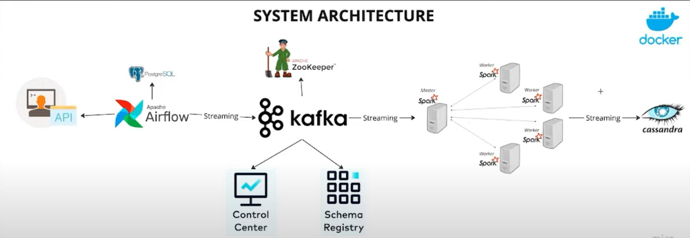
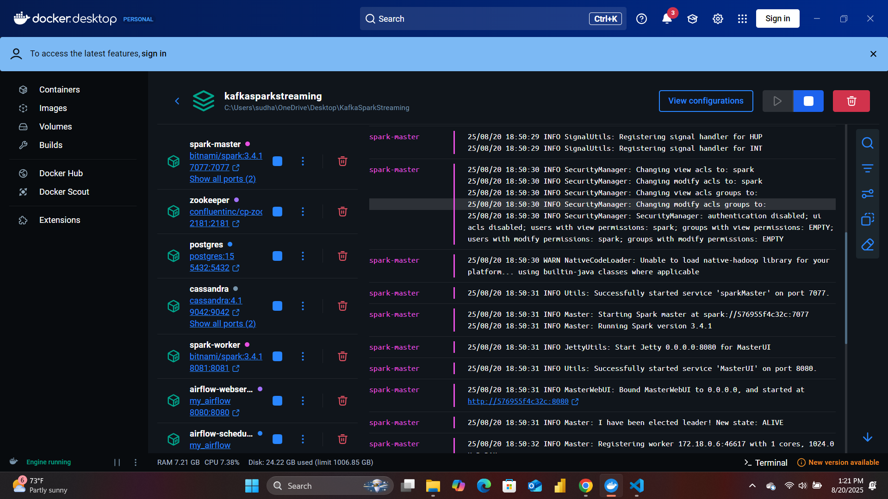
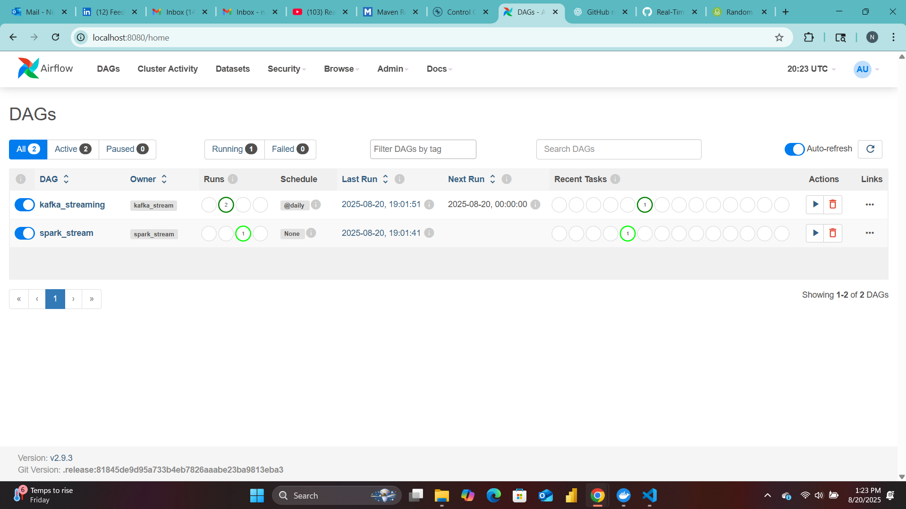
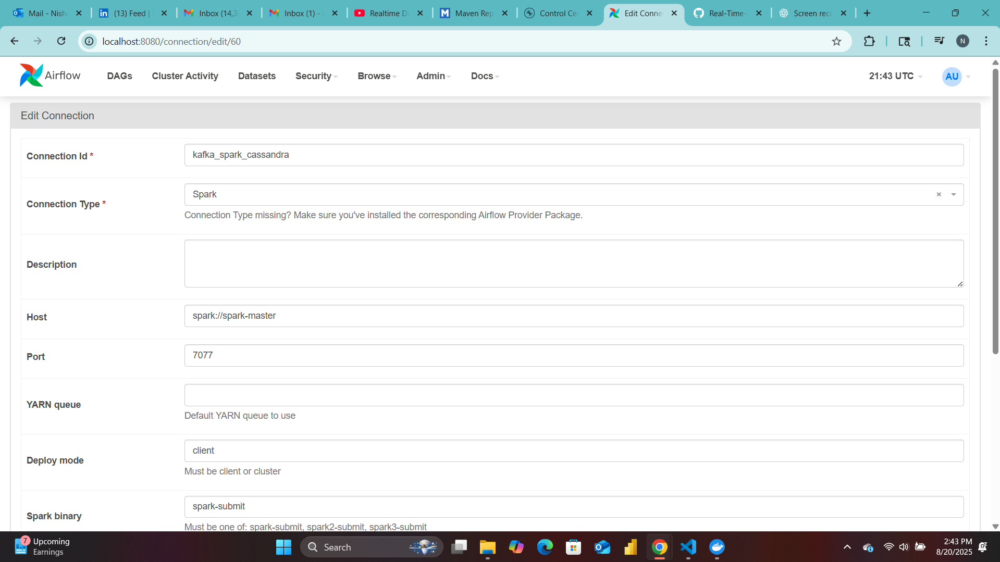
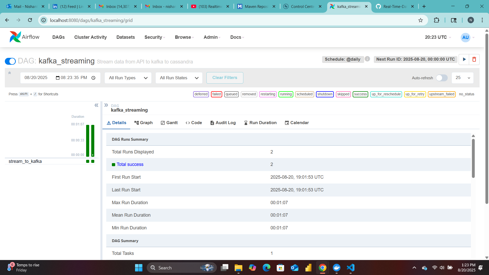
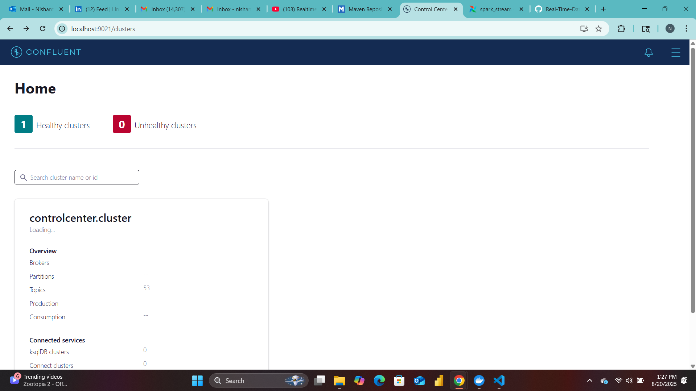
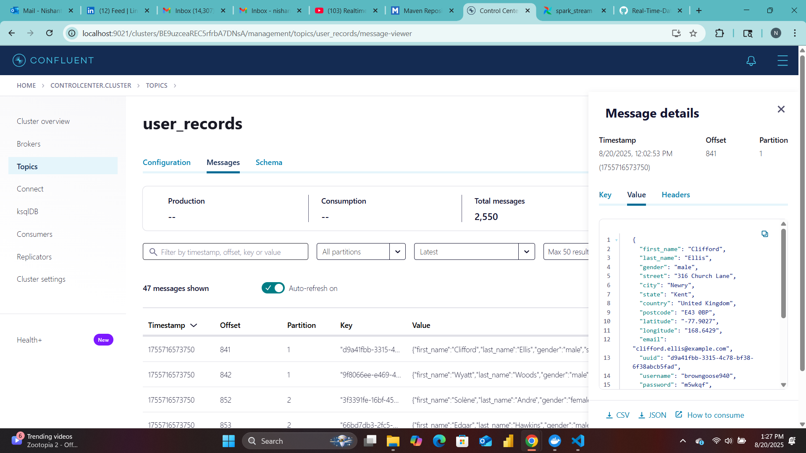
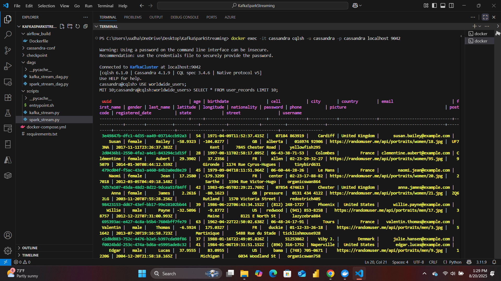

## Real-Time Data Streaming with Apache Kafka, Apache Spark, Airflow, and Cassandra


This project demonstrates the implementation of a real-time data streaming pipeline using **Apache Kafka, Apache Spark, Apache Airflow, Cassandra, and Docker**. It fetches live user data from an external API, processes it in real-time, and stores it in Cassandra for analytical and operational use. The solution follows a fully containerized architecture built using **Docker Compose**.


---

## **Solution Architecture**



## **Workflow Explanation**

### **1. Data Ingestion**
https://randomuser.me/
- Data is fetched from RandomUser API using a Python producer script.
- The producer sends user data to the Kafka topic **`user_records`**.
- Data is serialized as JSON string and encoded into bytes before sending.

### **2. Kafka Streaming Layer**
- Kafka brokers handle high-throughput, low-latency event streaming.
- Zookeeper manages Kafka broker coordination.
- The Schema Registry ensures consistent message formats.
- Confluent Control Center provides a monitoring dashboard for topics, partitions, and offsets.

### **3. Real-Time Processing with Spark**
- Spark Structured Streaming consumes events from Kafka in micro-batches.
- Data is parsed and transformed into a structured schema.
- Validated records are written directly to Cassandra in real-time.

### **4. Cassandra Storage Layer**
- Processed records are stored in the **`user_records`** table in the **`worldwide_users`** keyspace.

### **5. Workflow Orchestration with Airflow**
- Airflow DAG schedules and manages the entire pipeline.
- Uses the **`SparkSubmitOperator`** to trigger the Spark Structured Streaming job.
- Stores task metadata in PostgreSQL.
- Supports retry policies, failure handling, and manual triggers.

---

## **Technology Stack**

| Layer            | Technology                           |
|------------------|-------------------------------------|
| Data Source      | RandomUser API                       |
| Orchestration    | Apache Airflow                       |
| Streaming        | Apache Kafka, Zookeeper             |
| Schema Management| Confluent Schema Registry          |
| Monitoring       | Confluent Control Center            |
| Processing       | Apache Spark Structured Streaming  |
| Storage          | Apache Cassandra                    |
| Containerization | Docker Compose                      |
| Metadata DB      | PostgreSQL                          |

---

## **Repository Structure**

```
KafkaSparkStreaming
├── dags/                  # Airflow DAG scripts
├── scripts/               # Spark, Kafka, entrypoint, and API producer scripts
├── airflow_build/         # Custom Airflow image setup
├── cassandra-conf/        # Cassandra configurations
├── docker-compose.yml     # Full containerized environment setup
├── requirements.txt       # Python dependencies
├── architecture.png       # System architecture diagram
└── README.md              # Project documentation
```

## **Step-by-Step Implementation**

- **Make sure you have Docker set up and running in your host.**

### **1. Clone the Repository**
```
git clone https://github.com/nishanthsudhaharan29/Real-Time-Data-Streaming-using-Apache-Kafka.git
cd Real-Time-Data-Streaming-using-Apache-Kafka
```
### **2. Start the Docker Environment**
```
docker-compose up --build
```

This will start the following services:

- Zookeeper
- Kafka
- Schema Registry
- Control Center
- PostgreSQL
- Airflow Webserver
- Airflow Scheduler
- Spark Master
- Spark Worker
- Cassandra DB

### **3. Access the Airflow UI**
Open in your browser:
http://localhost:8080

username: admin
password: admin



### **4. Set up a Spark connection in Airflow**
- Go to Admin -> Connections
- Add a New Connection
- Connection Id: kafka_spark_cassandra
- Connection Type: Spark
- Host: spark://spark-master
- Port: 7077
- Deploy mode: client
- Spark binary: spark-submit



### **5. Start the Airflow DAG**
- Navigate to the Airflow dashboard.
- Enable the DAG kafka_streaming. This starts sending messages to kafka.
- Enable the DAG spark_stream. Airflow triggers the Spark job and begins streaming data from Kafka to Cassandra.


### **6. Access the Confluent Control Center**



Open in your browser:
http://localhost:9021

- Go to Topics -> user_records-> Mesages to see the incoming data


  
### **7. Verify Data in Cassandra**
- Enter the cassandra container's interactive terminal

```
docker exec -it cassandra cqlsh -u cassandra -p cassandra localhost 9042
```
```
USE worldwide_users;
SELECT * FROM user_records LIMIT 10;
```


## **Future Enhancements**

- Integrate Grafana + Prometheus for real-time monitoring
- Add Avro/Protobuf message formats for optimized serialization
- Implement S3/ADLS storage sink for long-term archival
- Add Power BI or Tableau dashboards for advanced visualization

## **Personal Learning Outcomes**
Through this project, I gained hands-on experience in:

- Building real-time streaming pipelines with Kafka and Spark
- Managing streaming jobs
- Using Airflow for orchestration
- Handling schema evolution with Confluent tools
- Working with Cassandra for distributed storage
- Deploying containerized big data pipelines using Docker Compose

## **Conclusion**
This project provides a scalable, fault-tolerant, and real-time data streaming solution. It can be extended to multiple real-time use cases like IoT telemetry, Social Media Analytics, Log Monitoring, and Real-time Weather.


